## 手写VIO大作业

#### 1. 更优的优化策略

##### a. 更优的LM策略：

原始代码中使用的Nielsen策略如下：

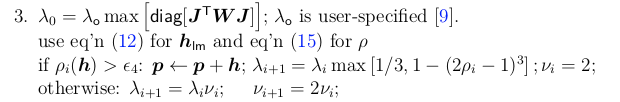

使用新策略如下：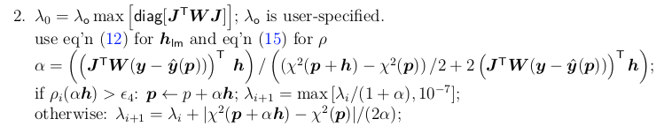

代码为(in `bool Problem::IsGoodStepInLM()`)：

```
            else if (OpStrategy_ == OptimizationStrategy::LM_MODIFIED)
            {
                // recompute residuals after update state
                // 统计所有的残差
                double tempChi = 0.0;
                for (auto edge : edges_)
                {
                    edge.second->ComputeResidual();
                    tempChi += edge.second->RobustChi2();
                }
                // compute alpha
                double alpha = (b_.transpose() * delta_x_);
                alpha = alpha / ((tempChi - currentChi_) / 2.0 + 2.0 * b_.transpose() * delta_x_);
                //alpha = std::max(alpha, 0.1);
                // RollbackStates();
                delta_x_ *= alpha;
                // UpdateStates();
                double scale = delta_x_.transpose() * (currentLambda_ * delta_x_ + b_);
                scale += 1e-3; // make sure it's non-zero :)
                tempChi = 0.0;
                for (auto edge : edges_)
                {
                    edge.second->ComputeResidual();
                    tempChi += edge.second->RobustChi2();
                }
                if (err_prior_.size() > 0)
                    tempChi += err_prior_.squaredNorm();
                tempChi *= 0.5; // 1/2 * err^2

                double rho = (currentChi_ - tempChi) / scale;
                if (rho > 0 && isfinite(tempChi)) // last step was good, 误差在下降
                {
                    currentLambda_ = (std::max)(currentLambda_ / (1 + alpha), 1.0e-7);
                    currentChi_ = tempChi;
                    return true;
                }
                else
                {
                    currentLambda_ += (std::abs)(currentChi_ - tempChi) / (2 * alpha);
                    return false;
                }
            }
```

与原有算法的对比如下：

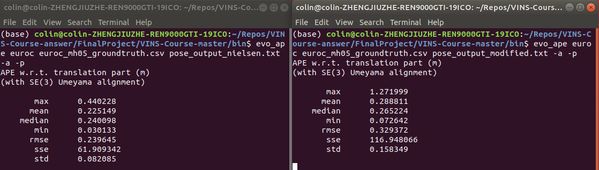

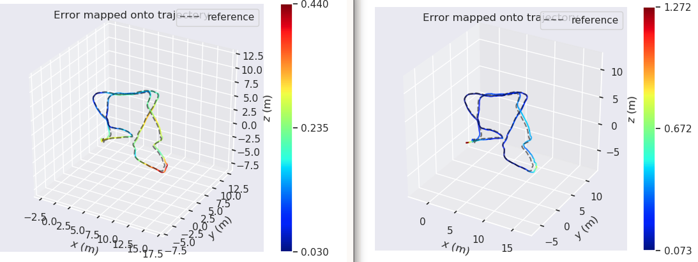

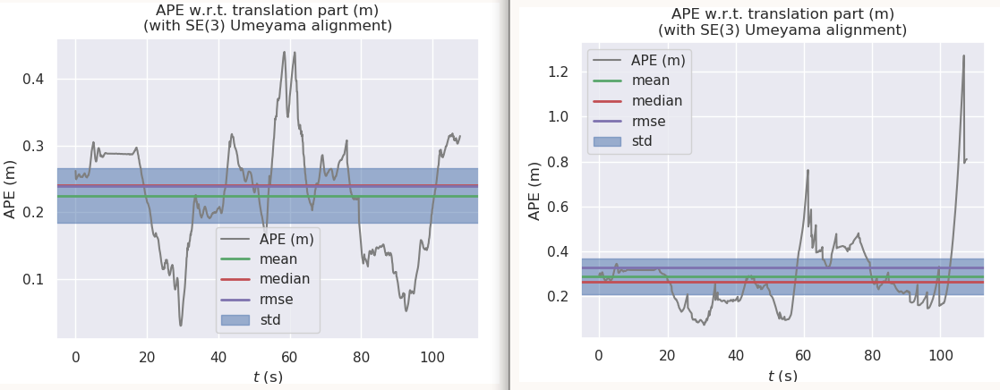

首先，在计算精度上，可以看出原始的LM策略在绝对位姿误差的平均值、均方根误差、误差最大最小值等指标上都比新的LM更新策略好，新的策略在第60s和110s左右的时刻出现了很大的偏差。下面针对两种策略的计算时间做一个对比:

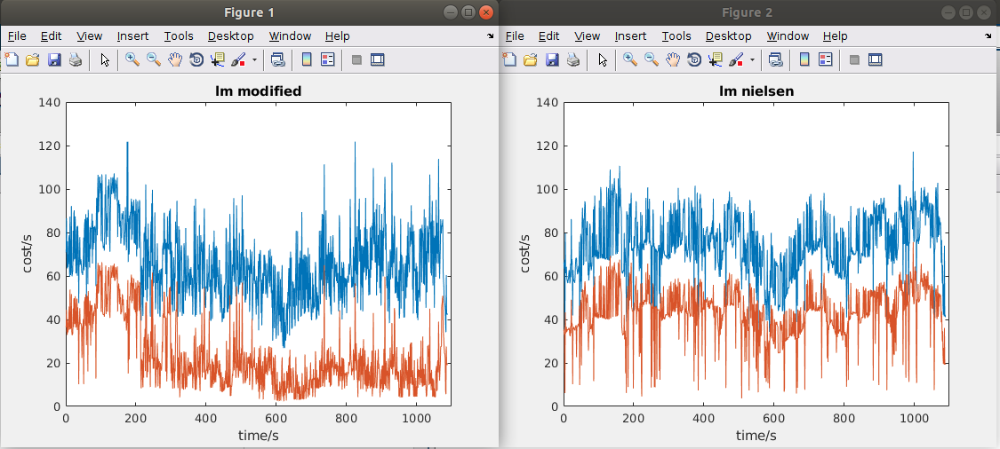

分别运行两种策略，CPU硬件为Intel® Core™ i7-9700K CPU @ 3.60GHz × 8。 更新的lm策略的平均求解耗时为66.1454ms，求解海塞矩阵的平均耗时为23.2693ms；Nielsen的平均求解耗时为74.3437ms，海塞矩阵的平均耗时为42.9631ms。

由此可见，使用新的LM更新策略虽然在精度上有所下降，但是计算时间得到了降低。

##### b. 实现dog-leg算法

狗腿算法的流程如下：

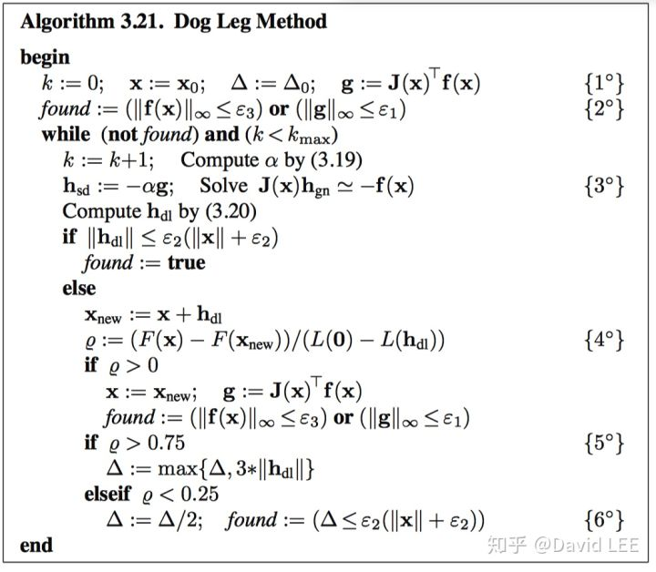

狗腿算法结合了高斯牛顿和最速下降的，使用置信区域来取代LM算法中的阻尼项。

其中，代码部分主要为：

in `void Problem::SolveLinearSystem()`:

```
                if (OpStrategy_ == OptimizationStrategy::DOGLEG)
                {
                    alpha = (b_.squaredNorm()) / (b_.transpose() * Hessian_ * b_);
                    delta_x_sd_ = alpha * b_; // the delta x of steepest descent method and guass-newton method
                    beta = 0.0;
                    delta_x_gn_ = delta_x_; // the delta x of guass-newton method
                    if (delta_x_gn_.norm() >= dogleg_radius_)
                    {
                        if ((alpha * delta_x_sd_).norm() >= dogleg_radius_)
                        {
                            delta_x_ = delta_x_sd_ * (dogleg_radius_ / delta_x_sd_.norm());
                        }
                        else
                        {
                            const VecX &a = delta_x_sd_;
                            const VecX &b = delta_x_gn_;
                            double c = a.transpose() * (b - a);
                            if (c <= 0)
                            {
                                beta = (-c + std::sqrt(c * c + (b - a).squaredNorm() * (dogleg_radius_ * dogleg_radius_ - a.squaredNorm()))) / (b - a).squaredNorm();
                            }
                            else
                            {
                                beta = (dogleg_radius_ * dogleg_radius_ - a.squaredNorm()) / (c + std::sqrt(c * c + (b - a).squaredNorm() * (dogleg_radius_ * dogleg_radius_ - a.squaredNorm())));
                            }
                            delta_x_ = delta_x_sd_ + beta * (delta_x_gn_ - delta_x_sd_);
                        }
                    }
                }
```

in `bool Problem::IsGoodStepInLM()`:

```
           else if (OpStrategy_ == OptimizationStrategy::DOGLEG)
            {
                double scale = 0;
                //    scale = 0.5 * delta_x_.transpose() * (currentLambda_ * delta_x_ + b_);
                //    scale += 1e-3;    // make sure it's non-zero :)
                //scale = 0.5 * delta_x_.transpose() * (currentLambda_ * delta_x_ + b_);
                scale = delta_x_.transpose() * b_;
                scale -= 0.5 * delta_x_.transpose() * Hessian_ * delta_x_;
                scale += 1e-6; // make sure it's non-zero :)

                // recompute residuals after update state
                double tempChi = 0.0;
                for (auto edge : edges_)
                {
                    edge.second->ComputeResidual();
                    tempChi += edge.second->RobustChi2();
                }
                if (err_prior_.size() > 0)
                    tempChi += err_prior_.squaredNorm();
                tempChi *= 0.5; // 1/2 * err^2

                double rho = (currentChi_ - tempChi) / scale;
                std::cout << "cureent rho is: " << rho << std::endl;
                std::cout << "delta chi: " << (currentChi_ - tempChi) << std::endl;
                std::cout << "cureent dogleg radius is: " << dogleg_radius_ << std::endl;

                if (rho > 0) // last step was good, 误差在下降
                {
                    currentChi_ = tempChi;
                    if (rho > 0.75)
                    {
                        dogleg_radius_ = std::max(dogleg_radius_, 3.0 * delta_x_.norm());
                    }
                    else if (rho < 0.25)
                    {
                        dogleg_radius_ /= 2.0;
                    }
                    return true;
                }
                else
                {
                    return false;
                }
            }
```

代码在https://github.com/Lee0326/VINS-Course-answer中。

最终结果评价也是从精度和计算耗时两方面评价，首先在精度方面，狗腿算法与LM的Nielsen算法基本一致，在标准差这一项上甚至好一点儿。

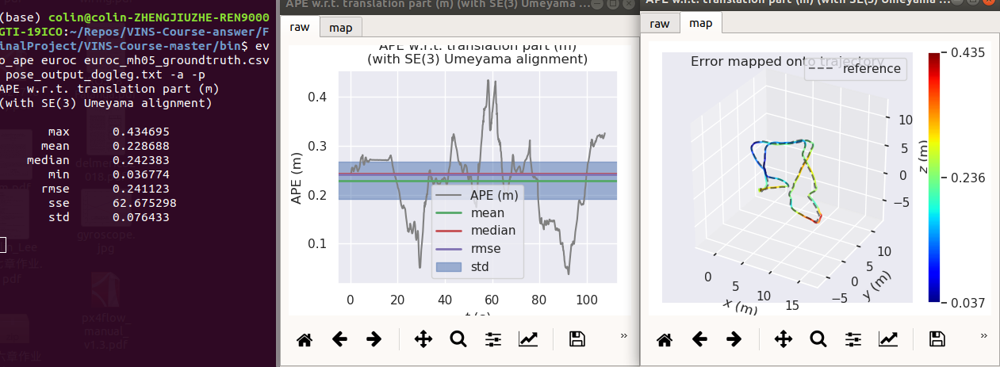

计算时间的结果如下：

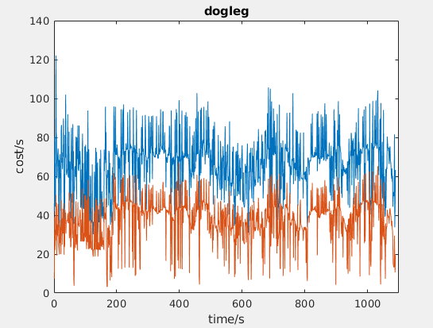

狗腿算法的平均求解耗时为66.5307ms，海塞矩阵的平均耗时为37.4136ms。求解时间与LM的修改版基本一致，但是与Nielsen相比，时间有所降低。总结，狗腿算法在保证计算精度与LM的Nielsen策略基本一致的基础上，实现了更低的计算耗时。

#### 2.更快的makehessian矩阵

使用OpenMP的方法进行多线程加速，CMakeLists.txt的配置如下：

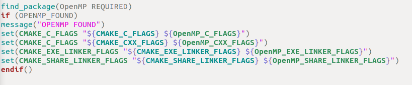

在problem.h中添加`#include <omp.h>`后，在problem.cc的`void Problem::SetOrdering()`中加入：

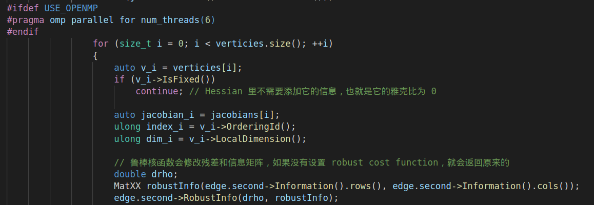

最终实现的精度为：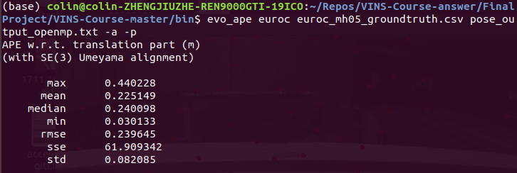

这与原始的Nielsen的策略一致，证明精度没有受到影响。但是在使用了OpenMP后，运行速度非但没有减少，反而增加了，不清楚是什么原因导致的，麻烦老师给看一下

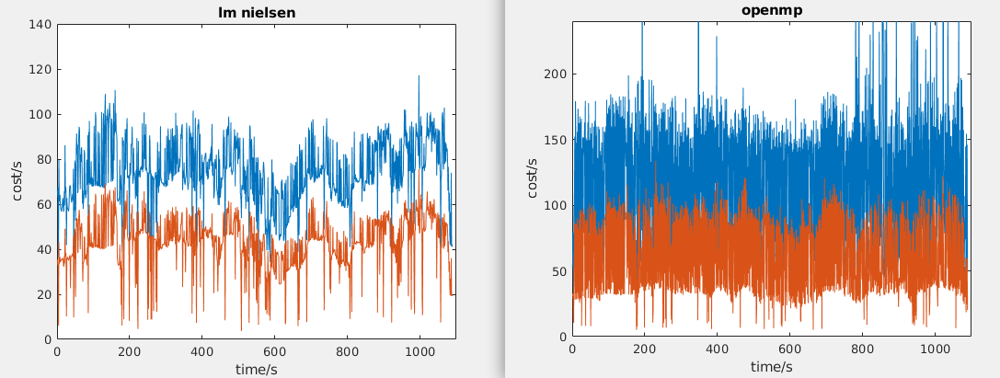